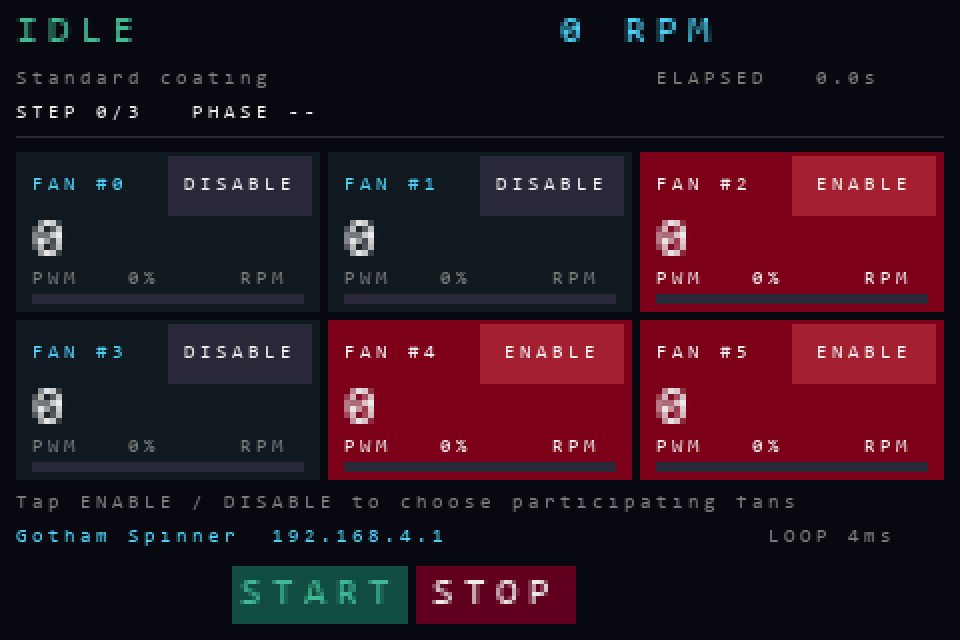

# Gotham Spinner

Why yet another thin film coating spinner project?

1) Six samples at once. We had a lot of samples to coat, so this was the primary motivation. 
2) Only about 1-2 hours to build. Mostly thanks to not needing to remove the blades from the fans. 
3) Parts budget under US$100- and all easy to get stuff.
4) No extra parts like transistors or level shifters. Just fans and the Pico. This took some extra effort, but helps with the low cost and quick assembly. 
5) Portable. In hindsight, I should have even added a handle to the top so you could carry it into the clean room like a little briefcase. 

Here is a video to inspire you to make one...
https://www.youtube.com/watch?v=6NayjZEfgNU

## Getting started

### 1. Parts 

#### 1.1 Bought

| Quantity | Part | What to choose |
| ---: | --- | --- |
| 1 | [Raspberry Pi Pico 2 W with headers](https://www.adafruit.com/product/6315) | The **Pico 2 W**, with both 20-pin headers fitted. The original Pico/Pico W uses a different chip. |
| 1 | [52Pi/GeeekPi Pico Breadboard Kit Plus, EP-0172](https://52pi.com/collections/rpi-pico/products/raspberry-pi-pico-pico-w-breadboard-kit-with-3-5-inch-touch-screen-display-led-indicator-on-board) | The version with the 3.5-inch touch TFT, buttons, and joystick. Choose the kit without an older Pico bundled in. |
| 6 | [ARCTIC P12 Pro fans](https://www.arctic.de/en/P12-Pro/ACFAN00305A) | 12 V, four-pin PWM, rated up to 3,000 RPM. Or you can use any 120mm fan that can make it up to 3000RPM.|
| 1 | Regulated 12 V DC power supply | At least **3 A** for six fans. I somehow found a power supply in my pile that had BOTH 12V and 5V DC outputs which makes for a cleaner setup - but you can easily power the Pico via any micro-USB connection. |
| 1 | Micro-USB **data** cable | Connects the Pico to your computer for installation, and supplies its USB power if needed durring operation. |
| 6 sets | Four-pin fan connectors/breakout leads, hookup wire, and power terminals | Each fan needs its own PWM and tach connections. Only the 12 V and ground distribution are shared. |
| 12 | 10-24 Screws to attach the fans to the panel. You you can use 24 screws if you need things to be symmetrical (but 12 is fine). I also used optional washers. 

I also used female sockets to attach the wire to the breadboard headers, but you can also solder directly on to them. 

#### 1.1 Made

**Panel** - Mine is laser cut from 3/16 acriylic but you could use anything flat and ridged and compatible with your spin liquid. You could also drill the holes if you dont have a laser cutter.
**Gravity chucks** - 3D printed. These are designed for our samples (27mm x 1mm disks) so you can adapt to your samples. 
**Shrouds** - 3D printed. Probably not necessary? But look cool. 

All manufaturing files are in [`/manufacturing`](/manufacturing`).

### 2. Assemble

#### Wiring 

Pretty obvious. Each fan's PWM and Tach signal goes to the mapped pin on the pico. All the fan 12V and GND wires are connect together connected to the 12V supply. The fan grounds are connected to the pico ground. That's really it!

| Fan tile | PWM GPIO (physical pin) | Tach GPIO (physical pin) | Kit modification |
| --- | --- | --- | --- |
| **#0** | GP18 (24) | GP19 (25) | None |
| **#1** | GP20 (26) | GP21 (27) | None |
| **#2** | GP22 (29) | GP28 (34) | None |
| **#3** | GP1 (2) | GP0 (1) | None |
| **#4** | GP13 (17) | GP12 (16) | Isolate RGB and buzzer branches |
| **#5** | GP16 (21) | GP17 (22) | Isolate D1 and D2 branches |

Here is how I dealt with the wire mess. You can probably do better. 

#### Assembling 

Bolt the fans to the back of the panel. Boom. You are done. 

Attach the chucks. I used 3M spray adhesive on the BACKs of the chucks. 

#### Optional upgrades

I moved the headers on the Pico to the BACK of the PCB so all the wires could be on the back side if the panel. It is a pain to desolder them, but you get a very nice and clean looking top. 

I made shrouds to be safe and because they make it look more like a normal spinner, but you probably do not need them. If you want them, glue them on. I used 3M spray adhesive. 

##### Modify the Breadboard

The breadboard does not leave us enough GPIOs for all the fans, so we are sharing the pins that go to the speaker, RGB LED,  D1, and D2. 

It will probably work fine if you leave these connected, just you might get some extra sights and sounds. The worst is the speaker, which is easily disconnected by unsoldering the SOT23 transistor that leads to it. If you are in a rush you can just clip it. Same goes for the other parts. 

There is an `AUX_LINKS_DISCONNECTED` setting if you want to complete suppress those pins and lose those 2 fans. 

### 4. Install MicroPython and the app

1. [Download the project](https://github.com/bigjosh/gotham-spincoater/archive/refs/heads/main.zip) and extract it, or clone this repository.
3. Hold the Pico's **BOOTSEL** button while connecting USB. Install the tested **MicroPython v1.29.0 ARM build for Pico 2 W** using the [firmware installation guide](firmware/README.md).
4. Follow that guide to identify **your** Pico's serial connection and copy the `.py` files inside `device/` to the Pico's top-level filesystem, with `main.py` last. This is a one-time software installation; it does not require editing the control code.
5. Reset the Pico. The six-tile dashboard should appear in **IDLE**, with every requested power at **0%**. `main.py` starts automatically on future boots.

### 5. UI

On the touch screen UI you can enable/disable each fan individually. START and STOP physical buttons. Try it. 

### 6 Recipes 

The Pico makes a WiFi called **Gotham Spinner**, with **no password**. Connect to it and you should get a "sign on" screen like on an airplane. If not, you can tell your phone something like "Stay connected" and then go to **[http://192.168.4.1/](http://192.168.4.1/)** into a browser. Use `http`, not `https`.

Click **New**, name the recipe **First spin**, and enter the three steps below. **Slew** is the time for the target to ramp from the previous speed; **dwell** is the time to hold the new target. Click **Save to coater**.

| Step | Target RPM | Slew (s) | Dwell (s) |
| --- | ---: | ---: | ---: |
| 1 | 0 | 0 | 0 |
| 2 | 1,000 | 10 | 5 |
| 3 | 0 | 5 | 0 |

### Liquid containment

The liquid should flow down thru the fans so you want something to catch it. A backing pan/tray would be good. Or a sheet of tin foil. You do want something that the fans can sit flat on to block airflow or else your max speed with be lower. 

## If RPMs do not get as high as you want

...probably too much airflow. Make sure fans are on something flat. Or break off the blades (too much work).

## How it works, and where to go next

Read my AI's insightful account about how it grinded thru a billion tokens trying to come up with a suitable filter that could clean up the noisy tach signal, and how I saved the day with a human out-of-the-box super simple and 100% reliable solutions (we have to gloat about this wins while we still can!)...

> **[The Genius Move: Read the Tach Between the Noise](THE_GENIUS_MOVE.md)** tells the story of the timing insight that made fan-speed measurement reliable: sample tach halfway through the longer PWM phase, away from switching disturbances.

| Document | Use it for |
| --- | --- |
| [PINOUT.md](PINOUT.md) | Every header pin and all six fan pairs |
| [BOARD_MODIFICATIONS.md](BOARD_MODIFICATIONS.md) | Freeing the four kit GPIOs needed for fans #4/#5 |
| [Firmware and app installation](firmware/README.md) | A fresh Pico 2 W, portable upload commands, and updates |
| [TECHNICAL_REFERENCE.md](TECHNICAL_REFERENCE.md) | Recipe details, electrical interface, PIO/control architecture, and APIs |
| [Validation record](artifacts/validation.md) | Test results, measured behavior, and development history |
| [Third-party notices](device/THIRD_PARTY_NOTICES.md) | Credits and licenses for adapted driver code |
