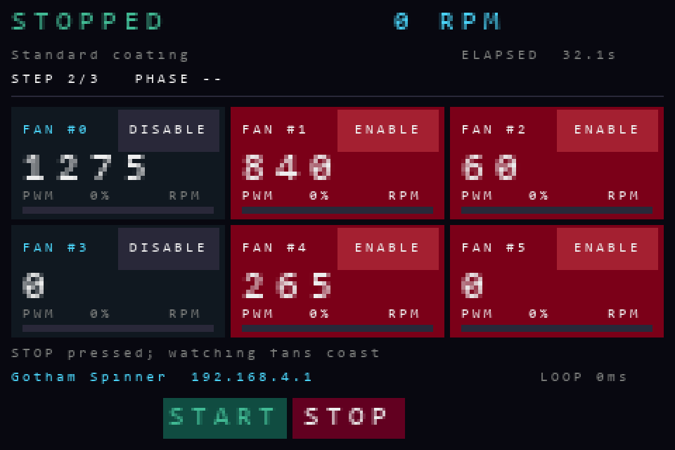
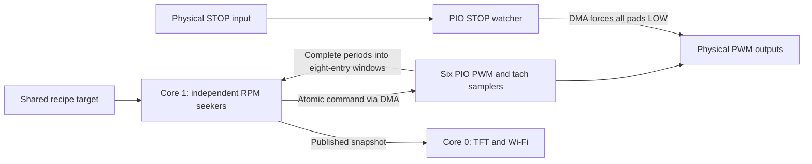

# Gotham Spinner

> **Tach problem solved — [The Genius Move: Read the Tach Between the Noise](THE_GENIUS_MOVE.md)**
>
> The builder's PWM-timing insight fixed the false-RPM problem on the real fan. That writeup records the original breakthrough; this controller extends it to continuous RPM control, recipes, and a six-fan dashboard.

MicroPython controller for **Raspberry Pi Pico 2 W**, six **ARCTIC P12 Pro** fans, and the **52Pi/GeeekPi Pico Breadboard Kit Plus (EP-0172)**. Each enabled fan independently adjusts PWM power to follow one shared RPM target. A TFT dashboard displays all six channels; a local Wi-Fi page edits recipes.

**All six fans are available; #0–#3 are selected by default.** The builder has confirmed the GPIO modifications for #4/#5, so their touch buttons now offer ENABLE. Use each tile's button to choose which fans participate; saved selections are preserved. Off-target RPM or missing tach produces a recoverable red warning while the fan continues to receive drive. Physical spin testing so far covers fan #0; enabling the other channels does not establish that they are wired or tested.

**Building all six channels? [Board modification guide: free the four auxiliary GPIOs](BOARD_MODIFICATIONS.md)** — component locations, connection tracing, desoldering, continuity checks, wiring, and firmware setup.

## Run a recipe

1. Connect and power the hardware below. Boot starts at **0% power**; interrupted recipes never resume automatically. Tap each fan's **ENABLE/DISABLE** button while stopped to select the connected fans.
2. Join the open Wi-Fi network **Gotham Spinner**. Open its captive-portal prompt or visit **[http://192.168.4.1/](http://192.168.4.1/)**. This local access point does not provide Internet access.
3. Select or edit a recipe, then choose **Save to coater** while idle. The page can create, copy, rename, delete, import, and export recipes.
4. Press **left START (BTN1 / GP15)** to run the saved selection.
5. Press **right STOP (BTN2 / GP14)** to command all outputs LOW. Releasing STOP does not restart a run; another run requires a fresh START press.

The joystick belongs to the earlier manual bench UI and does not change power in this application. Motor start is available only through the physical button.

The compact **START** and **STOP** footer labels are centered above the physical buttons, at approximately display x=160 and x=248. These positions come from the [manufacturer's straight-on board photograph](https://wiki.52pi.com/images/7/7e/EP-0127-03.jpg); the builder's 26.6 mm left / 44.5 mm right measurements fit the outer glass edges, which have unequal bezel margins. The footer labels do not act as touch controls.

The TFT and browser always show a numeric RPM for each fan, including idle, disabled, and STOP/coast-down states. **Show zero below** defaults to **60 RPM**: a reading below 60 displays 0; exactly 60 remains 60. Raw tach measurements remain available to the seeker. When no valid recent measurement exists the number is also 0, and the browser labels it **No recent tach**; this does not prove the shaft is stationary.

**Observed P12 Pro limitation:** in the 2026-09-09 physical test, fan #0 produced valid tach at 30% PWM, but its physical tach input stopped changing at 0% PWM, before software disable or hardware STOP was invoked. The PIO sampler continued running and retained the last reading until the 1.5-second timeout. Continuous capture therefore does not guarantee coast-down RPM from this fan's tach output. Disabled channels also receive 0% PWM. The exact internal cause and behavior of other fan units have not been established. [Measured transition](artifacts/validation.md#physical-tach-at-zero-pwm--2026-09-09).

An enabled fan turns **red** after staying outside the configured RPM percentage band for the configured time. Its actual requested power and bar remain visible, and red clears on the first in-bounds reading. Disabled channels retain their red disabled styling, zero requested power, and no participation in control or warning checks. The phase countdown shows remaining ramp or dwell time.



### Choose participating fans

Tap **DISABLE** on a connected fan's tile to exclude it, or **ENABLE** to include it. The button is in the upper-right corner of each tile. A held touch or drag does not repeatedly toggle a channel. Selection changes are allowed while idle, stopped, or complete; during a recipe the buttons show **RUN** or **OFF RPM** and changes are rejected until it stops. Enabling a fan never starts its motor: a fresh physical START press is still required.

Selections are saved automatically in **`fans.json`**, independently of recipes, and restored after reboot. Importing a recipe or deploying Python files does not overwrite them. All fans may be disabled; START then asks you to enable at least one. Fans marked **LOCKED** cannot be enabled through touch until their kit connections are physically isolated and `AUX_LINKS_DISCONNECTED` is set in firmware configuration.

The initial selection comes from `config.ENABLED_CHANNELS` only when neither `fans.json` nor its backup exists. A damaged primary recovers from a valid backup; if neither existing file is valid, all fans stay disabled until selected again. The saved format is `{"version": 1, "enabled": [0, 1]}`. Disabled available PWM outputs are actively held LOW while tach monitoring continues. The browser reflects selections; the touch buttons on the coater change them.

Touch uses the kit's GT911 controller on GP8/GP9, with GP10 reset and GP11 interrupt/address selection. Its coordinates are rotated to match the TFT. Touch polling and settings writes run on core 0; core 1 acknowledges an idle pause before a save and applies the selection with outputs LOW. Physical STOP remains handled by PIO. A touch read failure suppresses input until a confirmed release and does not disable the physical buttons.

## Recipes and control

A profile has **2–9 steps**, including first and last steps at **0 RPM**.

| Field | Meaning | Range |
| --- | --- | --- |
| `rpm` | Target at the end of this step's ramp | 0–4,000 RPM |
| `slew_s` | Time to ramp linearly from the preceding target | 0–3,600 s |
| `dwell_s` | Time to hold the requested target after this step's ramp | 0–3,600 s |

The [default recipe](examples/recipes.json) is:

| Step | Target | Ramp | Dwell |
| --- | --- | --- | --- |
| 1 | 0 RPM | 0 s | 0 s |
| 2 | 3,000 RPM | 15 s | 30 s |
| 3 | 0 RPM | 15 s | 0 s |

The default recipe lasts 60 seconds at the controller's 20 ms update resolution. Ramps and dwell follow their scheduled times; off-target fans do not extend the run. A target is a request, so a scheduled 30-second hold does not prove every fan spent 30 seconds at the requested speed. Motors can coast after the final zero-power command.

**RPM warnings are advisory and recover automatically.** Each enabled fan follows the same current target, including during a ramp. At a positive target, its deviation is `100 × abs(measured RPM − target RPM) / target RPM`. A deviation strictly greater than `rpm_warning_percent` starts that fan's timer. The tile turns red after `rpm_warning_delay_s` continuously outside bounds, and clears immediately on the first reading back within bounds. It remains selected and keeps seeking the target throughout. Warning timers clear when the run stops or completes.

For example, the default 5% band at 3,000 RPM is **2,850–3,150 RPM inclusive**. Remaining at 2,800 RPM for 2 seconds turns the fan red without removing its PWM drive; a reading of 2,900 RPM clears red immediately. At a zero target, a valid RPM at or below `tolerance_rpm` is in bounds, avoiding division by zero. Invalid or stale tach is outside bounds at a positive target. The display's zero threshold does not affect warnings or speed control.

The physical STOP button still actively drives every PWM LOW and latches until a fresh START. Actual driver failures that prevent reliable PWM operation remain distinct from RPM deviation: an affected driver is parked LOW and reported as a driver error, while working drivers continue. A fresh START retries the selected drivers. Controller-wide failures still stop every output.

| Setting | Default | Range |
| --- | --- | --- |
| `max_power_per_s` | 10 PWM percentage points/s | 0.1–100 |
| `tolerance_rpm` | ±50 RPM seeker deadband and zero-target warning band | 1–500 |
| `rpm_warning_percent` | 5% maximum RPM difference before timing a warning | 0.1–100% |
| `rpm_warning_delay_s` | 2 s continuously outside bounds before red | 0–120 s |
| `rpm_zero_threshold` | Display 0 below 60 RPM; display only | 0–1,000 RPM |

Each fan's normal adjustment rate is `0.01 × RPM error` percentage points/s, limited by `max_power_per_s`, with no adjustment inside the seeker deadband. The gain is `ControlEngine.SEEK_GAIN`. The warning percentage controls the red indication independently of that deadband. STOP and an explicit zero target command zero power on every channel. A slow control tick cannot accumulate a large catch-up adjustment.

Startup without valid tach increases drive at the configured rate, capped at **30% requested power** until a valid measurement arrives. After valid tach has been seen, missing measurements hold the last requested power and show the timed warning; they do not turn the fan off or force blind acceleration. Valid tach returning lets normal seeking resume immediately. The measurement source still marks readings stale after 1.5 seconds without a fresh period.

During a descent ending at zero, missing tach with requested power already at or below 30% causes power to **decrease only**, at the configured rate. This handles a fan entering its stop deadzone before a slow ramp reaches zero.

At a zero target, power stays LOW. A valid reading within the seeker deadband, or 1.5 seconds with no new tach activity, is considered in bounds. Recent pulses, overflow, and actual driver errors prevent treating an unknown measurement as confirmed quiet. Pulse absence is an **assumed quiet condition**, not proof of physical stop: a stationary fan and a disconnected tach lead cannot be distinguished this way. This condition does not delay recipe timing or gate tach capture. A display threshold of 0 disables suppression of valid positive RPM readings.

The Pico validates recipes, stages and checks JSON before replacement, and retains a backup. A damaged primary file falls back to its backup, then built-in defaults. Runs use detached recipe copies; edits are accepted only while idle.

Existing version-1 recipe files are migrated in memory: profiles, power limit, and seeker deadband are retained. The original settling/timeout schema receives warning defaults of 5% / 2 s and a 60-RPM zero threshold; the later four-setting warning schema only receives the 60-RPM threshold. Old settling/timeouts no longer govern recipe timing. The original file stays untouched until Save; import accepts all three complete schemas and export uses the current five settings. Changing the threshold while idle updates the displayed RPM immediately without START.

## Connect fan #0

Identify connector pins by numbers and key; cable colors can differ, including all-black cables.

| Fan connector | Connection |
| --- | --- |
| Pin 1: ground | External 12 V supply negative **and** Pico GND, e.g. physical pin 23 |
| Pin 2: motor power | External regulated **+12 V** |
| Pin 3: tachometer | **GP19**, physical pin **25** |
| Pin 4: PWM control | **GP18**, physical pin **24** |

Power the Pico through USB and the motor from the separate 12 V supply. Do not connect 12 V to a Pico GPIO or the kit's 3.3/5 V rails. Tach uses an internal **3.3 V pull-up**. An external **4.7 kΩ from GP19 to 3V3(OUT)** can strengthen that pull-up for longer or noisier wiring.

### Power order

1. Change wiring with fan power off.
2. Power the Pico through USB and wait for the idle dashboard.
3. Apply fan 12 V.
4. Finish by turning **fan power off first**, then removing Pico USB power.

A 0% command is not a power disconnect or proof of physical stop. A disconnected PWM wire can make a fan run at full speed. Secure the fan and keep spinning parts clear. A finished machine should use an appropriate interface and power arrangement rather than manual sequencing. This direct connection is specific to the powered RP2350 setup; it does not establish compatibility with an RP2040 Pico, ADC-capable GPIO, or a motherboard/hub's higher-voltage tach pull-up.

<a id="current-diagnostic-active-drive-and-synchronized-tach-sampling-at-10-khz"></a>

### Active drive at 10 kHz

The current `PioFan` driver actively drives **0 V and 3.3 V at 10 kHz**. Duty is positive: 0% holds LOW and 100% holds HIGH. Normal commands are quantized to 0.1 percentage point; pulses shorter than three PIO clocks round to their constant endpoint.

This working bench setting is below [ARCTIC's specified 21–28 kHz range](https://support.arctic.de/en/p12-pro). That page does not explicitly guarantee a 3.3 V PWM HIGH threshold. The builder confirmed that synchronous sampling solved the original false-RPM problem on the real fan. Separate speed and control evidence is recorded in [validation notes](artifacts/validation.md).

The old `PWM_PUSH_PULL`, `PWM_HZ`, and `SYNCHRONOUS_TACH` switches remain for legacy bench modules. They do **not** change the new combined driver's waveform; its timing is defined in [combined_program.py](device/combined_program.py).

## PWM, tach, and STOP in PIO

PWM switching produced disturbances on tach. Sampling **at the midpoint of the longer PWM phase** places each ideal sample at least 25 microseconds from either edge at 10 kHz. This rejects disturbances that settle before the sample; it does not repair electrical levels or reject noise persisting through that point.

Each fan's PIO state machine continuously generates the timing for PWM and midpoint tach sampling, and counts full falling-to-falling periods. It starts once during driver construction and retains its counter, FIFO, and averaging history through ordinary START, STOP, completion, fan selection, and settings edits. Constant 0% and 100% commands keep the sample clock running. A separate hardware STOP watcher forces the physical PWM outputs LOW without stopping these samplers.



- **PIO:** six continuously running fan state machines use one TX DMA each. Shared STOP watcher SM11 uses the last three words of the same 32-word program and triggers a six-channel one-shot DMA chain to force all PWM pads LOW. The watcher latches after button release. An empty fan command FIFO remains a separate hardware driver error and parks that output LOW. Neither STOP nor command-starvation protection requires Python servicing.
- **Core 1:** polls period FIFOs and runs control at 50 Hz. It averages eight periods, assumes two pulses per revolution, and publishes snapshots about every 100 ms. There is no per-sample or per-period Python tach IRQ.
- **Core 0:** handles display, Wi-Fi, HTTP/DNS, and idle persistence. The application checks the worker heartbeat and stops outputs if control stalls. Physical STOP remains available in PIO while Python is busy.

Python control timing remains subject to garbage collection and scheduling; PIO owns the fixed waveform timing. Fatal shutdown first asserts the shared STOP input LOW, then waits for the worker before releasing its resources. This avoids cross-core DMA cleanup races. The 50 Hz loop's measured timing under screen and Wi-Fi load is recorded in the validation notes.

STOP changes output permission, not measurement mode. Hardware DMA or a software stop sets the RP2350 GPIO OUTOVER LOW bit; the output remains enabled and the sampler keeps running. A fresh START rearms the shared latch and waits for zero commands to pass through each TX FIFO before clearing its output override. The latch is checked again before any positive command can be applied. There is no input override or sampler restart on normal run/stop transitions. `PioFan.pwm_is_low()` checks raw pad LOW plus output-enable status. Only close, unrecoverable resource failure, or explicit recovery from a driver error requires sampler teardown/reinitialization.

At 3,000 RPM, tach is 100 Hz; eight periods span approximately 80 ms. Python continuously computes `RPM = 60,000,000 / (mean period in microseconds × 2)` regardless of motor state. The display alone maps values below its threshold to zero. Sample resolution is 100 microseconds. There is no artificial RPM cap in the measurement path. Real timeout or FIFO overflow invalidates stale measurements and reacquires fresh periods; stopping motor power does not clear the window.

State machines `(0, 1, 2, 3, 8, 9)` serve the fans and SM11 watches STOP, leaving PIO1 for wireless. The six-fan rig uses 12 of the RP2350's 16 DMA channels before Wi-Fi. Unlike the original PWM-wrap sampler, it does not use PWM slices or their DREQs: each fan's PIO TX FIFO paces its DMA. Keep the CPU clock unchanged while the drivers are active.

## Six-fan GPIO allocation

See [the complete header map](PINOUT.md), with the Pico's USB connector at the top.

| Fan | PWM | Tach | Kit changes |
| --- | --- | --- | --- |
| 0 | GP18 (pin 24) | GP19 (pin 25) | None; available, selected by default |
| 1 | GP20 (pin 26) | GP21 (pin 27) | None; available, selected by default |
| 2 | GP22 (pin 29) | GP28 (pin 34) | None; available, selected by default; tach stays at 3.3 V |
| 3 | GP1 (pin 2) | GP0 (pin 1) | None; available, selected by default |
| 4 | GP13 (pin 17) | GP12 (pin 16) | RGB and beeper isolation confirmed; available, initially disabled |
| 5 | GP16 (pin 21) | GP17 (pin 22) | D1 and D2 isolation confirmed; available, initially disabled |

With the Pico's USB connector at the top, each pair places **tach immediately above PWM**, on the same header. Fan #2 keeps its nonadjacent GP22/GP28 assignment. **Fans #3–#5 must be rewired for this map before deployment**, with power disconnected; #0–#2 are unchanged. Saved fan selections and recipe settings stay associated with their fan numbers.

Preserve GP2–11 for display/touch, GP14/15 for buttons, and GP26/27 for the kit joystick. GP4 is physically connected to TFT MISO even though the display driver does not read it.

`device/config.py` defaults to **`ENABLED_CHANNELS = (0, 1, 2, 3)`** with **`AUX_LINKS_DISCONNECTED = True`** following the builder's modification confirmation on 2026-09-08. Saved touch selections take precedence over the initial default. Unlocking #4/#5 does not select them automatically; use their ENABLE buttons. Every selected fan follows the shared RPM target with its own PWM correction. For a one-fan bench setup, leave only #0 enabled before starting a recipe.

### Preparing the kit for fans #4 and #5

The builder has completed this modification on the project kit. For an **unmodified kit**, set `AUX_LINKS_DISCONNECTED = False` and follow the **[complete board modification instructions](BOARD_MODIFICATIONS.md)** before unlocking these channels. Isolate the GP12 RGB-data branch, GP13 buzzer-driver input, GP16 D1 branch, and GP17 D2 branch. Preserve the display/touch resistor bank, buttons, joystick, and D3/D4 supply indicators.

The guide includes the manufacturer's component-location photograph and a power-off tracing and inspection procedure. Manufacturer documentation mentions removable 0Ω connections, but does not establish the exact resistor references or values for all four auxiliary branches. Identify each series connection on the actual board before desoldering; do not assume every nearby resistor is a jumper. Set the configuration flag only after the physical isolation checks pass.

## Files and APIs

| Current module | Role |
| --- | --- |
| [main.py](device/main.py) | Startup, Wi-Fi AP, core-0 loop, cleanup |
| [runtime.py](device/runtime.py) | Core-1 ownership, buttons, START/edit exclusion |
| [control.py](device/control.py) | Hardware-free recipe state machine and RPM seekers |
| [recipes.py](device/recipes.py) | Schema validation, defaults, backup persistence |
| [pio_fan.py](device/pio_fan.py) | PIO/DMA ownership, FIFO polling, driver-error detection |
| [stop_guard.py](device/stop_guard.py) | Shared hardware STOP latch and GPIO-override DMA chain |
| [combined_program.py](device/combined_program.py) | PWM/tach/STOP instructions and command encoding |
| [periods.py](device/periods.py) | Mean of complete tach periods |
| [dashboard.py](device/dashboard.py), [display.py](device/display.py) | Six-fan TFT and ST7796S drawing |
| [touch.py](device/touch.py), [touch_controls.py](device/touch_controls.py) | GT911 touch decoding and per-fan button routing |
| [fan_settings.py](device/fan_settings.py) | Independent persistent fan selection and recovery |
| [portal.py](device/portal.py), [webpage.py](device/webpage.py) | Captive DNS, bounded HTTP, browser editor |
| [config.py](device/config.py) | Pins, enabled channels, display, AP |
| [THIRD_PARTY_NOTICES.md](device/THIRD_PARTY_NOTICES.md) | Attributions and licenses |

**Legacy bench modules:** `fan.py`, `rig.py`, `ui.py`, `sync_tach.py`, `sync_program.py`, and `open_drain_pwm.py` retain earlier manual control, PWM-wrap sampling, and open-drain experiments. Current `main.py` initializes `Controller` and `PioFan`, not those older paths. The [original breakthrough writeup](THE_GENIUS_MOVE.md) describes the earlier 17-instruction sampler and its original validation.

The pure Python API is `ControlEngine(enabled=(0,), settings=None)`, then `start(profile, settings, now_ms)`, `update(now_ms, readings)`, `snapshot()`, and `stop(reason)`. `configure_settings(settings)` updates settings while idle. `update` accepts readings from all six fans and returns six requested duty percentages; only enabled entries are applied. Snapshots retain validated `rpm`/`valid`, thresholded `display_rpm`, and diagnostic `raw_rpm`, `period_us`, `samples`, `pulses`, and `age_ms`. A negative producer RPM is rejected and logged as `TACH_NEGATIVE` with its window diagnostics; it is never presented as physical speed. `RecipeBook(path)` provides `load()`, `save(document)`, `selectedprofile()`, and `settings()`. Production use goes through runtime ownership and physical START checks.

| HTTP endpoint | Purpose |
| --- | --- |
| `GET /api/status` | Published run/fan snapshot |
| `GET /api/config` | Saved recipe document |
| `PUT` or `POST /api/config` | Validate/save the full document while idle |

Writes require `Content-Type: application/json` and at most 32 KiB. Busy runs/edits return 409; invalid values return 400. No motor start/stop endpoints are exposed.

## Deploy and test

The board uses official **MicroPython v1.29.0 for RPI_PICO2_W**; [firmware notes](firmware/README.md) record its download and verification. Download the firmware binary separately.

The Windows helper identifies this project's USB serial **8792b44d9c11021d** before opening it. **COM4 and COM5 are always excluded.** COM7 was its last observed port; discovery does not rely on that assignment. Reusing the helper requires deliberately updating its identity guard after identifying the new board.

```powershell
.\tools\pico.ps1 -Action Info
.\tools\pico.ps1 -Action Deploy
.\tools\pico.ps1 -Action Launch -Seconds 5
.\tools\pico.ps1 -Action Monitor -Seconds 10
.\tools\pico.ps1 -Action Reboot
```

`Info`, `Exec`, `Deploy`, and `Launch` interrupt the app and stop its outputs. `Monitor` observes without stopping it. Deploy backs up overwritten Python files, stages uploads, checks SHA-256 readback, and activates `main.py` last. Saved on-board `recipes.json` and `fans.json` are separate from deployment; import [the example recipe JSON](examples/recipes.json) through the browser. Boot runs `main.py` automatically.

`Reboot` restarts only the identified project Pico; use `Monitor` after USB reconnects to inspect automatic startup. `Deploy -Only control.py,runtime.py` updates selected files. Reboot after extended REPL development sessions to release old module references and heap fragmentation.

Run hardware-free tests with CPython:

```text
python -m unittest discover -s tests -v
```

Tests cover controller transitions/limits, persistence recovery, START/edit races, HTTP/DNS, PIO instruction timing, resource ownership, and legacy regressions. Actual board/fan evidence belongs in [artifacts/validation.md](artifacts/validation.md); generated tach tests are not physical fan measurements.

`tools/test_fan_settings_board.py` checks saved selections, all-off behavior, GPIO locks, the worker heartbeat, and LOW PWM outputs using a separate temporary settings file. It never starts a recipe and preserves the user's `fans.json` and `recipes.json`. Run it through `pico.ps1 -Action Exec -CodeFile tools/test_fan_settings_board.py` after deploying the modules, then reboot into the normal app. Touch hit alignment still needs a physical tap check on the installed display.

`tools/test_continuous_rpm_board.py` checks all six passive samplers, raw actively LOW PWM pads, disabled-channel RPM display, the 59/60 RPM threshold boundary, and fresh updates with STOP held LOW. It uses scripted RPM, never starts a recipe, and preserves saved files. Run it through the guarded `Exec` helper, then reboot. Physical tach capture during coast-down requires a separate observation on the attached fans.

`tools/test_rpm_warning_board.py` runs the control engine with scripted tach readings, without accessing GPIOs. `tools/test_rpm_warning_runtime_board.py` exercises all six live PIO drivers with an all-zero-RPM recipe and scripted tach: fan #0's warning appears and clears while every driver remains armed at 0%. `tools/test_driver_error_board.py` separately checks that an actual driver error parks only the affected output. These tests do not change saved selections or recipes. Run each through the guarded `Exec` helper after deployment, then reboot. Scripted tach and zero-power tests do not establish positive-power operation of six physical fans.

`tools/test_tach_continuity_board.py` exercises real six-channel PIO edge timing and FIFO averaging at zero power. It simulates tach edges with internal GPIO input overrides without electrically driving the tach leads, then verifies uninterrupted capture through START, held STOP, release, and restart. It also checks the hardware STOP DMA with no Python worker running. No saved files are accessed; overrides are restored afterward. Run through the guarded `Exec` helper after deployment and reboot into the normal app afterward.

`tools/diagnose_stopped_tach.py` temporarily runs the normal display with START ignored, all outputs LOW, and physical tach input diagnostics for 60 seconds. `tools/diagnose_coast_tach.py` performs a real motor test: after a 10-second countdown it drives only fan #0 at 30% for four seconds, then observes zero duty, software disable, and asserted hardware STOP. It logs raw pin transitions and PIO period data without generated tach or input overrides. Keep the fan clear for this motor test, run through guarded `Exec`, and reboot afterward. Neither diagnostic changes saved files.

`tools/test_combined_board.py` drives **spare GP0/GP1** to test the current driver, continuous duty changes, STOP, command starvation, and FIFO recovery; it asserts the real shared GP14 STOP line LOW and releases it to input. Run only with GP0/GP1 unconnected and the normal app's PIO resources released. The older `test_sync_board.py` uses GP0/GP1 and PIO1 SM4, requiring wireless to be inactive. `selftest.py` uses GP0/GP1 and SM10/11 for the original GPIO-IRQ test. Never run pin-driving tests after attaching additional fans or devices to those pins.

`test_capacity_board.py` exercises six combined engines and Wi-Fi on a shared dummy output; it does not verify six physical motors. `test_seeker_board.py` runs the attached GP18/19 fan through several RPM targets. `test_app_board.py` starts the full default recipe after a 20-second idle window, using a disposable recipe file. A host joined to its AP can run `test_portal_wifi.py` during that window to verify saving, captive DNS, busy lockout, and HTTP traffic during the hold. These live tests require a secured, unloaded fan and keep physical STOP active.

## Sources

- [52Pi kit specification and pinout](https://wiki.52pi.com/index.php?title=EP-0172)
- [Manufacturer's Pico 2 example](https://github.com/geeekpi/pico_breadboard_kit/tree/pico2)
- [Manufacturer's board-link photograph](https://wiki.52pi.com/images/thumb/4/4d/EP-0127-14.jpg/800px-EP-0127-14.jpg)
- [ARCTIC P12 Pro electrical interface](https://support.arctic.de/en/p12-pro)
- [RP2350 datasheet](https://datasheets.raspberrypi.com/rp2350/rp2350-datasheet.pdf)
- [MicroPython PIO documentation](https://docs.micropython.org/en/v1.29.0/library/rp2.PIO.html)
- [Intel QST reference for standard tach pulse count](https://www.intel.com/content/dam/develop/external/us/en/documents/intel-qst-programmers-reference-manual.pdf)
