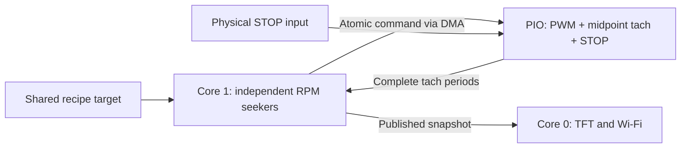

# Gotham Spinner

> **Tach problem solved — [The Genius Move: Read the Tach Between the Noise](THE_GENIUS_MOVE.md)**
>
> The builder's PWM-timing insight fixed the false-RPM problem on the real fan. That writeup records the original breakthrough; this controller extends it to continuous RPM control, recipes, and a six-fan dashboard.

MicroPython controller for **Raspberry Pi Pico 2 W**, six **ARCTIC P12 Pro** fans, and the **52Pi/GeeekPi Pico Breadboard Kit Plus (EP-0172)**. Each enabled fan independently adjusts PWM power to follow one shared RPM target. A TFT dashboard displays all six channels; a local Wi-Fi page edits recipes.

**Fans #0–#3 are enabled.** These four pairs use GPIOs free of kit peripherals; fans #4/#5 remain disabled until their occupied GPIOs are physically isolated. Connect all four enabled fans before pressing START: missing tach on any enabled channel faults the whole recipe. Physical spin testing so far covers fan #0; enabling the other channels does not establish that they are wired or tested.

**Building all six channels? [Board modification guide: free the four auxiliary GPIOs](BOARD_MODIFICATIONS.md)** — component locations, connection tracing, desoldering, continuity checks, wiring, and firmware setup.

## Run a recipe

1. Connect and power the hardware below. Boot starts at **0% power**; interrupted recipes never resume automatically.
2. Join the open Wi-Fi network **Gotham Spinner**. Open its captive-portal prompt or visit **[http://192.168.4.1/](http://192.168.4.1/)**. This local access point does not provide Internet access.
3. Select or edit a recipe, then choose **Save to coater** while idle. The page can create, copy, rename, delete, import, and export recipes.
4. Press **left START (BTN1 / GP15)** to run the saved selection.
5. Press **right STOP (BTN2 / GP14)** to command all outputs LOW. Releasing STOP does not restart a run; another run requires a fresh START press.

The joystick belongs to the earlier manual bench UI and does not change power in this application. Motor start is available only through the physical button.

The TFT and browser show the run state, target, step, phase countdown, elapsed time, and each fan's RPM and requested power. Disabled channels are dimmed. **`--` means no valid recent tach measurement**, rather than a measured zero shaft speed. The phase countdown shows ramp time, remaining reach timeout, or unconsumed dwell time according to the state.


## Recipes and control

A profile has **2–9 steps**, including first and last steps at **0 RPM**.

| Field | Meaning | Range |
| --- | --- | --- |
| `rpm` | Target at the end of this step's ramp | 0–4,000 RPM |
| `slew_s` | Time to ramp linearly from the preceding target | 0–3,600 s |
| `dwell_s` | Time spent at the settled target | 0–3,600 s |

The [default recipe](examples/recipes.json) is:

| Step | Target | Ramp | Dwell |
| --- | --- | --- | --- |
| 1 | 0 RPM | 0 s | 0 s |
| 2 | 3,000 RPM | 15 s | 30 s |
| 3 | 0 RPM | 15 s | 0 s |

Planned ramps and dwell total 60 seconds. Initial quiet detection, settling, and final coast-down add time. A target is a request; the controller does not assume every fan can reach every permitted RPM.

After each ramp, **all enabled fans** must remain within tolerance for the settling interval before dwell starts. Dwell counts only while all remain within tolerance, and pauses if any leaves the band. A reach timeout, persistent tach loss, or hardware fault commands every output LOW and leaves the run faulted.

| Setting | Default | Range |
| --- | --- | --- |
| `max_power_per_s` | 10 PWM percentage points/s | 0.1–100 |
| `tolerance_rpm` | ±50 RPM | 1–500 |
| `settle_s` | 0.5 s continuously in tolerance | 0.05–10 s |
| `reach_timeout_s` | 15 s to reach/recover target | 1–120 s |

Each fan's normal adjustment rate is `0.01 × RPM error` percentage points/s, limited by `max_power_per_s`, with no adjustment inside tolerance. The gain is `ControlEngine.SEEK_GAIN`. STOP, FAULT, and an explicit zero target command zero power immediately. A slow control tick cannot accumulate a large catch-up adjustment.

Startup without tach is limited to **8 seconds and at most 30% requested power**. Once valid tach has been observed, a missing signal normally holds power briefly, then faults after **1.5 seconds of invalid readings**. The measurement source itself also has a 1.5-second stale-data timeout.

During a descent ending at zero, missing tach with requested power already at or below 30% causes power to **decrease only**, at the configured rate. This handles a fan entering its stop deadzone before a slow ramp reaches zero. Other positive-target losses still fault.

At a zero target, power stays LOW. Valid near-zero readings or 1.5 seconds with no new tach pulses allow settling to proceed. Pulse absence is an **assumed quiet condition**, not proof of physical stop: a stationary fan and a disconnected tach lead cannot be distinguished this way.

The Pico validates recipes, stages and checks JSON before replacement, and retains a backup. A damaged primary file falls back to its backup, then built-in defaults. Runs use detached recipe copies; edits are accepted only while idle.

## Connect fan #0

Identify connector pins by numbers and key; cable colors can differ, including all-black cables.

| Fan connector | Connection |
| --- | --- |
| Pin 1: ground | External 12 V supply negative **and** Pico GND, e.g. physical pin 23 |
| Pin 2: motor power | External regulated **+12 V** |
| Pin 3: tachometer | **GP19**, physical pin **25** |
| Pin 4: PWM control | **GP18**, physical pin **24** |

Power the Pico through USB and the motor from the separate 12 V supply. Do not connect 12 V to a Pico GPIO or the kit's 3.3/5 V rails. Tach uses an internal **3.3 V pull-up**. An external **4.7 kΩ from GP19 to 3V3(OUT)** can strengthen that pull-up for longer or noisier wiring.

### Power order

1. Change wiring with fan power off.
2. Power the Pico through USB and wait for the idle dashboard.
3. Apply fan 12 V.
4. Finish by turning **fan power off first**, then removing Pico USB power.

A 0% command is not a power disconnect or proof of physical stop. A disconnected PWM wire can make a fan run at full speed. Secure the fan and keep spinning parts clear. A finished machine should use an appropriate interface and power arrangement rather than manual sequencing. This direct connection is specific to the powered RP2350 setup; it does not establish compatibility with an RP2040 Pico, ADC-capable GPIO, or a motherboard/hub's higher-voltage tach pull-up.

<a id="current-diagnostic-active-drive-and-synchronized-tach-sampling-at-10-khz"></a>

### Active drive at 10 kHz

The current `PioFan` driver actively drives **0 V and 3.3 V at 10 kHz**. Duty is positive: 0% holds LOW and 100% holds HIGH. Normal commands are quantized to 0.1 percentage point; pulses shorter than three PIO clocks round to their constant endpoint.

This working bench setting is below [ARCTIC's specified 21–28 kHz range](https://support.arctic.de/en/p12-pro). That page does not explicitly guarantee a 3.3 V PWM HIGH threshold. The builder confirmed that synchronous sampling solved the original false-RPM problem on the real fan. Separate speed and control evidence is recorded in [validation notes](artifacts/validation.md).

The old `PWM_PUSH_PULL`, `PWM_HZ`, and `SYNCHRONOUS_TACH` switches remain for legacy bench modules. They do **not** change the new combined driver's waveform; its timing is defined in [combined_program.py](device/combined_program.py).

## PWM, tach, and STOP in PIO

PWM switching produced disturbances on tach. Sampling **at the midpoint of the longer PWM phase** places each ideal sample at least 25 microseconds from either edge at 10 kHz. This rejects disturbances that settle before the sample; it does not repair electrical levels or reject noise persisting through that point.

The current combined program generates PWM, samples tach, counts full falling-to-falling periods, and checks STOP in one state machine. Period counts survive duty changes, allowing continuous measurement during ramps. Constant 0% and 100% commands keep the sample clock running.



- **PIO:** one state machine and one DMA channel per enabled fan. The 32-instruction program occupies each used PIO block. STOP is checked each 100-microsecond cycle and latches LOW. An empty command FIFO also latches LOW and raises a fault. These checks do not need Python servicing.
- **Core 1:** polls period FIFOs and runs control at 50 Hz. It averages eight periods, assumes two pulses per revolution, and publishes snapshots about every 100 ms. There is no per-sample or per-period Python tach IRQ.
- **Core 0:** handles display, Wi-Fi, HTTP/DNS, and idle persistence. The application checks the worker heartbeat and stops outputs if control stalls. Physical STOP remains available in PIO while Python is busy.

Python control timing remains subject to garbage collection and scheduling; PIO owns the fixed waveform timing. Fatal shutdown first asserts the shared STOP input LOW, then waits for the worker before releasing its resources. This avoids cross-core DMA cleanup races. The 50 Hz loop's measured timing under screen and Wi-Fi load is recorded in the validation notes.

At 3,000 RPM, tach is 100 Hz; eight periods span approximately 80 ms. Sample resolution is 100 microseconds. There is no artificial RPM cap in the measurement path. FIFO overflow discards old queued measurements and reacquires fresh periods.

State machines `(0, 1, 2, 3, 8, 9)` allow six fans while reserving PIO1 for wireless. Unlike the original PWM-wrap sampler, the combined driver does not use PWM slices or their DREQs: each channel's PIO TX FIFO paces its DMA. Keep the CPU clock unchanged while the drivers are active.

## Six-fan GPIO allocation

See [the complete header map](PINOUT.md), with the Pico's USB connector at the top.

| Fan | PWM | Tach | Kit changes |
| --- | --- | --- | --- |
| 0 | GP18 (pin 24) | GP19 (pin 25) | None; enabled |
| 1 | GP20 (pin 26) | GP21 (pin 27) | None; enabled |
| 2 | GP22 (pin 29) | GP28 (pin 34) | None; enabled; tach stays at 3.3 V |
| 3 | GP0 (pin 1) | GP1 (pin 2) | None; enabled |
| 4 | GP12 (pin 16) | GP16 (pin 21) | Disconnect RGB and D1 links |
| 5 | GP13 (pin 17) | GP17 (pin 22) | Disconnect beeper and D2 links |

Preserve GP2–11 for display/touch, GP14/15 for buttons, and GP26/27 for the kit joystick. GP4 is physically connected to TFT MISO even though the display driver does not read it.

`device/config.py` selects **`ENABLED_CHANNELS = (0, 1, 2, 3)`** with **`AUX_LINKS_DISCONNECTED = False`**. The unmodified kit provides four independent pairs, not five. Both channels #4/#5 require physical link disconnection before setting the flag to `True`; that modification has not been made. Every enabled fan follows the shared RPM target with its own PWM correction. For a one-fan bench setup, select `(0,)` and deploy that configuration before starting a recipe.

### Preparing the kit for fans #4 and #5

Follow the **[complete board modification instructions](BOARD_MODIFICATIONS.md)** before enabling these channels. Isolate the GP12 RGB-data branch, GP13 buzzer-driver input, GP16 D1 branch, and GP17 D2 branch. Preserve the display/touch resistor bank, buttons, joystick, and D3/D4 supply indicators.

The guide includes the manufacturer's component-location photograph and a power-off tracing and inspection procedure. Manufacturer documentation mentions removable 0Ω connections, but does not establish the exact resistor references or values for all four auxiliary branches. Identify each series connection on the actual board before desoldering; do not assume every nearby resistor is a jumper. Set the configuration flag only after the physical isolation checks pass.

## Files and APIs

| Current module | Role |
| --- | --- |
| [main.py](device/main.py) | Startup, Wi-Fi AP, core-0 loop, cleanup |
| [runtime.py](device/runtime.py) | Core-1 ownership, buttons, START/edit exclusion |
| [control.py](device/control.py) | Hardware-free recipe state machine and RPM seekers |
| [recipes.py](device/recipes.py) | Schema validation, defaults, backup persistence |
| [pio_fan.py](device/pio_fan.py) | PIO/DMA ownership, FIFO polling, fault detection |
| [combined_program.py](device/combined_program.py) | PWM/tach/STOP instructions and command encoding |
| [periods.py](device/periods.py) | Mean of complete tach periods |
| [dashboard.py](device/dashboard.py), [display.py](device/display.py) | Six-fan TFT and ST7796S drawing |
| [portal.py](device/portal.py), [webpage.py](device/webpage.py) | Captive DNS, bounded HTTP, browser editor |
| [config.py](device/config.py) | Pins, enabled channels, display, AP |
| [THIRD_PARTY_NOTICES.md](device/THIRD_PARTY_NOTICES.md) | Attributions and licenses |

**Legacy bench modules:** `fan.py`, `rig.py`, `ui.py`, `sync_tach.py`, `sync_program.py`, and `open_drain_pwm.py` retain earlier manual control, PWM-wrap sampling, and open-drain experiments. Current `main.py` initializes `Controller` and `PioFan`, not those older paths. The [original breakthrough writeup](THE_GENIUS_MOVE.md) describes the earlier 17-instruction sampler and its original validation.

The pure Python API is `ControlEngine(enabled=(0,))`, then `start(profile, settings, now_ms)`, `update(now_ms, readings)`, `snapshot()`, and `stop(reason)`. `update` returns six requested duty percentages; only enabled entries are applied. `RecipeBook(path)` provides `load()`, `save(document)`, `selectedprofile()`, and `settings()`. Production use goes through runtime ownership and physical START checks.

| HTTP endpoint | Purpose |
| --- | --- |
| `GET /api/status` | Published run/fan snapshot |
| `GET /api/config` | Saved recipe document |
| `PUT` or `POST /api/config` | Validate/save the full document while idle |

Writes require `Content-Type: application/json` and at most 32 KiB. Busy runs/edits return 409; invalid values return 400. No motor start/stop endpoints are exposed.

## Deploy and test

The board uses official **MicroPython v1.29.0 for RPI_PICO2_W**; [firmware notes](firmware/README.md) record its download and verification. Download the firmware binary separately.

The Windows helper identifies this project's USB serial **8792b44d9c11021d** before opening it. **COM4 and COM5 are always excluded.** COM7 was its last observed port; discovery does not rely on that assignment. Reusing the helper requires deliberately updating its identity guard after identifying the new board.

```powershell
.\tools\pico.ps1 -Action Info
.\tools\pico.ps1 -Action Deploy
.\tools\pico.ps1 -Action Launch -Seconds 5
.\tools\pico.ps1 -Action Monitor -Seconds 10
.\tools\pico.ps1 -Action Reboot
```

`Info`, `Exec`, `Deploy`, and `Launch` interrupt the app and stop its outputs. `Monitor` observes without stopping it. Deploy backs up overwritten Python files, stages uploads, checks SHA-256 readback, and activates `main.py` last. Saved on-board `recipes.json` is separate from deployment; import [the example JSON](examples/recipes.json) through the browser. Boot runs `main.py` automatically.

`Reboot` restarts only the identified project Pico; use `Monitor` after USB reconnects to inspect automatic startup. `Deploy -Only control.py,runtime.py` updates selected files. Reboot after extended REPL development sessions to release old module references and heap fragmentation.

Run hardware-free tests with CPython:

```text
python -m unittest discover -s tests -v
```

Tests cover controller transitions/limits, persistence recovery, START/edit races, HTTP/DNS, PIO instruction timing, resource ownership, and legacy regressions. Actual board/fan evidence belongs in [artifacts/validation.md](artifacts/validation.md); generated tach tests are not physical fan measurements.

`tools/test_combined_board.py` drives **spare GP0/GP1/GP20** to test the current driver, continuous duty changes, STOP, command starvation, and FIFO recovery. Run only with these pins unconnected and the normal app's PIO resources released. The older `test_sync_board.py` uses GP0/GP1 and PIO1 SM4, requiring wireless to be inactive. `selftest.py` uses GP0/GP1 and SM10/11 for the original GPIO-IRQ test. Never run pin-driving tests after attaching additional fans or devices to those pins.

`test_capacity_board.py` exercises six combined engines and Wi-Fi on a shared dummy output; it does not verify six physical motors. `test_seeker_board.py` runs the attached GP18/19 fan through several RPM targets. `test_app_board.py` starts the full default recipe after a 20-second idle window, using a disposable recipe file. A host joined to its AP can run `test_portal_wifi.py` during that window to verify saving, captive DNS, busy lockout, and HTTP traffic during the hold. These live tests require a secured, unloaded fan and keep physical STOP active.

## Sources

- [52Pi kit specification and pinout](https://wiki.52pi.com/index.php?title=EP-0172)
- [Manufacturer's Pico 2 example](https://github.com/geeekpi/pico_breadboard_kit/tree/pico2)
- [Manufacturer's board-link photograph](https://wiki.52pi.com/images/thumb/4/4d/EP-0127-14.jpg/800px-EP-0127-14.jpg)
- [ARCTIC P12 Pro electrical interface](https://support.arctic.de/en/p12-pro)
- [RP2350 datasheet](https://datasheets.raspberrypi.com/rp2350/rp2350-datasheet.pdf)
- [MicroPython PIO documentation](https://docs.micropython.org/en/v1.29.0/library/rp2.PIO.html)
- [Intel QST reference for standard tach pulse count](https://www.intel.com/content/dam/develop/external/us/en/documents/intel-qst-programmers-reference-manual.pdf)
