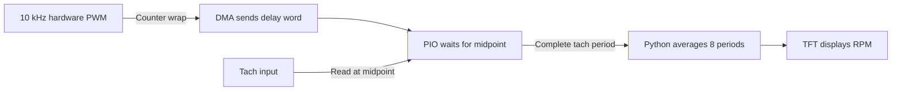

# The Genius Move: Read the Tach Between the Noise

**A well-earned victory for the person at the bench.** The breakthrough came from a beautifully practical observation: the Pico was generating the PWM signal, so it already knew when the switching edges would happen. That knowledge could tell it when to read the tach.

The idea became working firmware. After testing it with the real fan, the builder reported:

> dude, problem 100% solved!

*Gotham spin coater · Pico 2 W · ARCTIC P12 Pro · September 8, 2026*

## The problem: a fan with an imaginary racing career

The project began with a goal: run six fans, ramp to 3,000 RPM, and hold for 30 seconds. First, one fan needed a reliable speed measurement.

With only the tach wire connected, the reading was accurate. Connecting PWM made the reported speed jump into the tens of thousands of RPM. One recorded peak was **57,692.5 RPM**. The scope showed PWM-related disturbances riding on the tach waveform, especially during its HIGH phase.

The tach input was counting transitions. Switching disturbances could cross the input threshold and look like extra tach edges. The existing 500-microsecond minimum edge spacing still admitted regularly recurring interference, producing absurd speed readings.

We considered faster PWM, low-pass filtering, and a rolling sample average with a threshold. Then came the insight that unlocked the solution.

## The question that solved it

The builder asked:

> we are the ones GENERATING the PWM signal, so why not SAMPLE the tach signal at the midpoint between the LONGER phase of the PWM signal?

Exactly. **Use the timing information the controller already owns.**

Each PWM period has a HIGH phase and a LOW phase. Choosing the midpoint of the longer phase puts the sample as far as possible from either switching edge. Brief disturbances get time to settle before the tach input is read.

At **10 kHz**, a PWM period is **100 microseconds**. The longer phase lasts at least 50 microseconds, so its ideal midpoint is at least **25 microseconds from either edge**. The choice adapts to duty:

| PWM duty | Longer phase | Ideal sample time after PWM wrap |
| --- | --- | --- |
| 25% | LOW | 62.5 µs |
| 50% | Equal; choose HIGH | 25 µs |
| 75% | HIGH | 37.5 µs |
| 0% or 100% | Constant output | 50 µs into each timer cycle |

DMA delivery and input synchronization add a small hardware latency. The timing margin is what makes this useful: the intended sample sits well inside the quiet part of the waveform.

This is a sharp application of synchronous sampling. The credit belongs to the builder for spotting that the PWM timing itself supplied the missing information. “I am a genius, right?” was an entirely understandable reaction.

## The first implementation

The first bench version handled the timing in hardware:



One PIO state machine per fan samples tach once per PWM cycle. It remembers the sampled HIGH/LOW state and counts complete falling-edge-to-falling-edge periods. Python receives those period measurements and averages the latest eight before converting to RPM.

With two tach pulses per revolution:

```text
RPM = 60,000,000 / (mean period in microseconds × 2)

10,000 µs per tach cycle → 100 Hz → 3,000 RPM
```

At 3,000 RPM, each fan produces about **100 measurement interrupts per second**. Six fans produce about **600**, while hardware handles all **60,000 samples per second**. The shared PIO program is only **17 instructions**, using six state machines and six DMA channels for six fans.

The implementation also handles two easily missed details: the PWM counter keeps sampling alive at 0% and 100% output, and channels sharing a PWM timer share a coordinated DMA trigger chain. The existing internal tach pull-up remains enabled. Fan #0 uses **GP18 for PWM and GP19 for tach**.

## The result: the idea survived contact with the bench

| Check | Result |
| --- | --- |
| Six simultaneous samplers, generated 100 Hz tach with switching-edge spikes | All six reported 3,000 RPM at 25%, 50%, and 75% PWM |
| Independent tach signal at constant 0% and 100% PWM | All six continued measuring correctly |
| Tach stops producing pulses | Reading becomes stale after the configured timeout |
| One sampler in a shared timer group closes | Remaining samplers continue working |
| Host software checks | 57 tests passed |
| Real fan, after deployment | **Builder confirmed the reported problem was completely solved** |

The physical confirmation is the payoff. The earlier six-channel test established that the implementation could handle the workload and reject the injected disturbances; the builder's real-fan test confirmed that the idea addressed the actual bench problem.

This closed the reported false-RPM problem. At that point, the manual firmware reset its averaging window on duty changes, and automatic ramp/hold control was still a separate milestone. The successful 10 kHz bench setting is below ARCTIC's documented 21–28 kHz range, as recorded in the [electrical interface notes](TECHNICAL_REFERENCE.md#electrical-interface).

## The follow-through: let PIO own the whole cycle

The completed [Gotham Spinner application](README.md) builds on that same insight. Each of six fans gets a PIO state machine that **generates PWM, samples tach at the midpoint, and counts complete tach periods**. Changing duty and pressing STOP preserve tach capture. Python polls the measured periods on a separate control core, while the other core handles the six-fan dashboard and Wi-Fi recipe editor.

The combined program occupies 32 instructions in each used PIO block. Six fan state machines and a separate STOP watcher use seven state machines and twelve DMA channels, leaving PIO1 for Wi-Fi. The watcher forces the physical PWM outputs LOW through hardware DMA and latches until a fresh START; the tach samplers keep running. An empty command FIFO independently parks the affected output LOW. There are no per-tach Python interrupt handlers in this version.

The builder declared the project complete and successful on September 10, 2026. The controller now supports six independently regulated fans, programmable ramp/hold recipes, touchscreen fan selection, and browser editing with JSON import/export. The original timing insight remains at the center of its measurement system.

One distinction matters: sampling continuously does not make a fan supply tach when its own controller stops reporting it. On the tested P12 Pro, the physical tach signal goes quiet at zero PWM; a stale reading becomes zero after 1.5 seconds even if the rotor is still coasting. See the [validation record](artifacts/validation.md) for measurements and the [technical reference](TECHNICAL_REFERENCE.md) for the current architecture.

**An excellent piece of engineering intuition: notice the useful information already present, then make the hardware act on it.**

Current implementation: [combined PIO program](device/combined_program.py), [fan driver](device/pio_fan.py), [period averaging](device/periods.py). Original breakthrough: [PIO sampler](device/sync_program.py), [DMA and timing](device/sync_tach.py), [board test transcript](artifacts/sync-board-test.txt). Evidence: [validation notes](artifacts/validation.md).
